# RecoverAI Architecture

The following architecture diagram illustrates the closed-loop, bounded autonomous financial workflow of the RecoverAI platform. 

It is designed to strictly separate **probabilistic AI reasoning** from **deterministic policy execution**, ensuring enterprise-grade safety, auditability, and measurable ROI.

```mermaid
flowchart TD
    %% Base styling for nodes with enterprise fintech color palette
    classDef ai fill:#f4f0ff,stroke:#8b5cf6,stroke-width:2px,color:#4c1d95,rx:6px
    classDef det fill:#eff6ff,stroke:#3b82f6,stroke-width:2px,color:#1e3a8a,rx:6px
    classDef ext fill:#f0fdf4,stroke:#22c55e,stroke-width:2px,color:#14532d,rx:6px
    classDef esc fill:#fff1f2,stroke:#f43f5e,stroke-width:2px,color:#9f1239,rx:6px
    classDef blocked fill:#f8fafc,stroke:#94a3b8,stroke-width:2px,color:#334155,rx:6px
    classDef metric fill:#f8fafc,stroke:#64748b,stroke-width:2px,color:#0f172a,rx:6px
    
    %% Typography overrides
    classDef title fill:none,stroke:none,font-size:28px,font-weight:bold,color:#0f172a
    classDef subtitle fill:none,stroke:none,font-size:18px,color:#475569
    classDef footer fill:none,stroke:none,font-size:16px,font-weight:bold,font-style:italic,color:#334155

    %% Header
    Title["RECOVERAI: BOUNDED AUTONOMOUS REVENUE RECOVERY"]:::title
    Subtitle["Closed-Loop Financial Agent Architecture"]:::subtitle
    Title --- Subtitle
    
    %% Main Flow Nodes
    E["<b>1. EVENT</b><br/>Payment Failure<br/>Checkout Abandonment<br/>Overdue Receivable"]:::ext
    D["<b>2. CONTEXT & DETECTION</b><br/>Event Context<br/>Root Cause<br/>Customer LTV<br/>Transaction Amount<br/>Failure History<br/>Previous Attempts"]:::det
    A["<b>3. AI REASONING</b><br/>Gemini / Qwen<br/>Recovery Probability Estimate<br/>Confidence<br/>Strategy Recommendation"]:::ai
    P["<b>4. POLICY & RISK GATE</b><br/>Business Rules<br/>Risk Thresholds<br/>Retry Limits<br/>Human Review"]:::det
    
    %% Execution Layer
    API["<b>5. TOOL / API EXECUTION</b><br/>Razorpay Service / API Layer<br/>SMART_RETRY<br/>PAYMENT_LINK<br/>REMINDER<br/>PROMISE_TO_PAY<br/>INCENTIVE"]:::ext
    HUMAN["<b>HUMAN REVIEW</b><br/>Escalation Queue"]:::esc
    NOACTION["<b>NO ACTION</b><br/>Blocked by Policy"]:::blocked

    V["<b>6. VERIFICATION</b><br/>Payment Success / Failure<br/>Webhook Feedback<br/>Recovery Outcome<br/>Promise-to-Pay Fulfillment"]:::det
    AU["<b>7. AUDIT</b><br/>Decision<br/>Confidence<br/>Root Cause<br/>Action<br/>Outcome<br/>Timestamp"]:::metric
    M["<b>8. METRICS / ROI</b><br/>Revenue Recovered<br/>Recovery Rate<br/>Expected Net Revenue<br/>AI vs Rule-Based Performance"]:::metric
    
    F["AI recommends. Policy controls. APIs execute. Outcomes verify. Metrics prove value."]:::footer

    %% Connections
    Subtitle ~~~ E
    E --> D
    D --> A
    A -->|"Decision, Recommendation, Confidence, Explanation"| P
    
    P -->|"APPROVED"| API
    P -->|"REVIEW"| HUMAN
    P -->|"BLOCKED"| NOACTION
    
    API --> V
    HUMAN --> V
    NOACTION --> V
    
    V --> AU
    AU --> M
    
    M ~~~ F
    
    %% Feedback Loop
    V -.->|"Outcome Feedback"| D
    
    %% Legend
    subgraph LEGEND ["<b>Legend</b>"]
        direction LR
        L1[AI Reasoning]:::ai
        L2[Deterministic Control]:::det
        L3[External / API Execution]:::ext
        L4[Human Escalation]:::esc
        L5[Feedback / Audit]:::metric
    end
    style LEGEND fill:transparent,stroke:#cbd5e1,stroke-width:1px,rx:8px

    F ~~~ LEGEND
```

